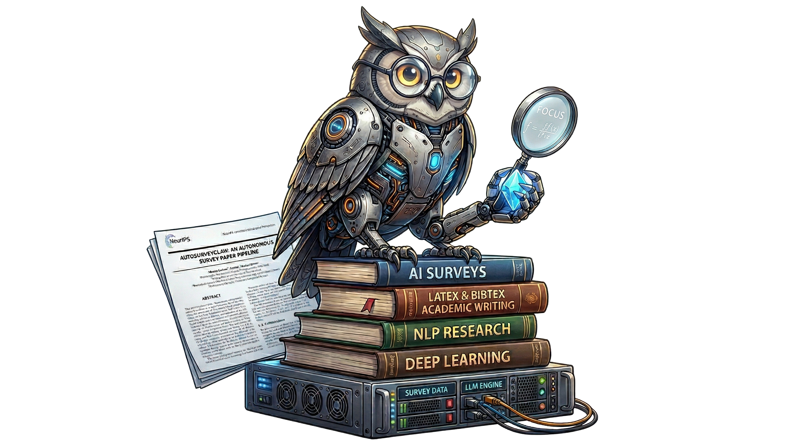
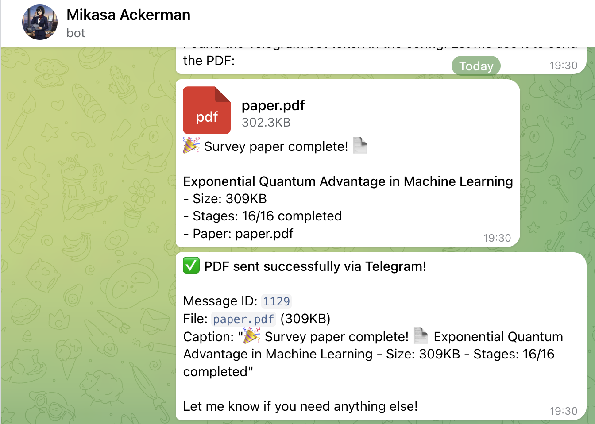
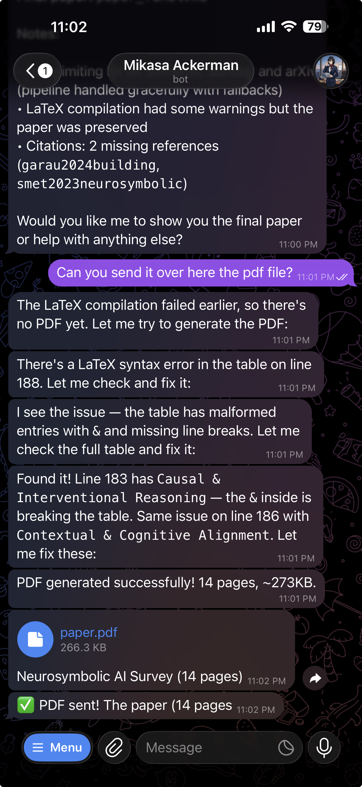

# AutoSurveyClaw

[](https://www.python.org/downloads/)
[](https://opensource.org/licenses/MIT)

<p align="center">
  
</p>

AutoSurveyClaw is an autonomous pipeline that transforms a research topic into a publication-ready survey paper. Specify a topic, configure your LLM, and the pipeline handles literature search, synthesis, taxonomy generation, multi-pass drafting, peer review simulation, and LaTeX export — fully unattended.

**[LATEST UPDATE] RUN USING GEMMA4:E4B MODEL and COMPATIBLE WITH OPENCLAW (RECOMMENDED USAGE\*) AS SEEN IN THE SCREENSHOT BELOW**

See config_qml_e4b.yaml for configuration and the output in artifacts and demo folder. 

<p align="center">
  
  
</p>

*Openclaw can fix any syntax error produced by the weaker model (Gemma4:e4b) which might break the pipeline as seen in picture 2.


## Features

- **Autonomous end-to-end**: From topic → outline → draft → peer review → revision → LaTeX → PDF
- **PhD-level survey quality**: Three-call writing architecture targeting 12,000–16,000 words; per-paper depth, master comparison tables, named open challenges
- **Literature harvesting**: Semantic Scholar and arXiv APIs with relevance filtering
- **Dynamic taxonomy**: Automatically clusters papers into structured categories
- **LaTeX + PDF output**: NeurIPS-style template; PDF compiled via pdflatex (requires TeX Live)
- **LLM-agnostic**: Works with Ollama (local), OpenAI, Anthropic, or any OpenAI-compatible API

---

## Prerequisites

| Requirement | Notes |
|---|---|
| Python 3.11+ | `python --version` |
| An LLM provider | Ollama (local) **or** OpenAI / Anthropic API key |
| `pdflatex` | Optional — needed to compile `.tex` → `.pdf` |

### Installing pdflatex (Ubuntu/Debian)

```bash
sudo apt-get install -y texlive-latex-base texlive-latex-recommended \
                        texlive-latex-extra bibtex2bib
```

Without pdflatex the pipeline still produces a complete `.tex` file; the PDF step is skipped.

---

## Installation

```bash
git clone https://github.com/your-username/AutoSurveyClaw.git
cd AutoSurveyClaw
pip install -e .
```

For optional extras (PDF extraction, web crawling):

```bash
pip install -e ".[all]"
```

---

## Configuration

Copy the example config and fill in your LLM settings:

```bash
cp config.surveyclaw.example.yaml config.yaml
```

### Ollama (local, no API key)

```yaml
llm:
  provider: "ollama"
  base_url: "http://localhost:11434/v1"
  api_key: ""
  primary_model: "qwen3.5:35b"
  fallback_models:
    - "qwen3.5:9b"

memory:
  enabled: true
  embedding_model: "qwen3-embedding:4b"
```

Make sure Ollama is running before starting the pipeline:

```bash
ollama serve
ollama pull qwen3.5:35b
ollama pull qwen3-embedding:4b
```

### OpenAI-compatible API

```yaml
llm:
  provider: "openai-compatible"
  base_url: "https://api.openai.com/v1"
  api_key_env: "OPENAI_API_KEY"   # reads from environment variable
  primary_model: "gpt-4o"
  fallback_models:
    - "gpt-4o-mini"
```

Set the key in your environment:

```bash
export OPENAI_API_KEY=sk-...
```

### Key config fields

| Field | Description | Default |
|---|---|---|
| `research.topic` | Survey topic (overridden by `--topic` flag) | required |
| `research.daily_paper_count` | Papers fetched per search query | `10` |
| `research.quality_threshold` | Minimum relevance score (0–5) | `4.0` |
| `project.mode` | `survey` for literature review; `full-auto` for research | `full-auto` |
| `runtime.timezone` | Timezone for scheduling | `America/New_York` |
| `security.hitl_required_stages` | Stages requiring human approval | `[5, 13]` |

---

## Running a Survey

```bash
surveyclaw review --topic "Neurosymbolic AI: Integrating Neural Networks and Symbolic Reasoning" \
                  --config config.yaml
```

Or set the topic in `config.yaml` under `research.topic` and run:

```bash
surveyclaw review --config config.yaml
```

To skip gate approvals at stages 5 and 13 and run fully unattended:

```bash
surveyclaw review --config config.yaml --auto-approve
```

To resume the pipeline after an interruption or a failed stage, use the `--resume` flag. By default, it will automatically find the most recent run in the `artifacts/` folder and pick up exactly where it left off (e.g. at the failed stage):

```bash
surveyclaw review --resume
```

You can also specify a particular run directory to resume:

```bash
surveyclaw review --output artifacts/survey-20260413-125521-399082 --resume
```

---

## Output

All outputs are written to `artifacts/<run-id>/`:

```
artifacts/my-survey-run/
  stage-01/ … stage-16/     # Per-stage intermediates and decision logs
  deliverables/
    paper_final.md           # Final Markdown draft
    paper.tex                # NeurIPS-formatted LaTeX
    paper.pdf                # Compiled PDF (requires pdflatex)
    references.bib           # BibTeX bibliography
```

### Getting PDF output

PDF generation happens automatically at Stage 15 (Export & Publish) if `pdflatex` is on your PATH. To verify:

```bash
which pdflatex    # should print a path
```

If pdflatex is missing, install TeX Live (see Prerequisites above), then re-run from Stage 15:

```bash
surveyclaw review --config config.yaml --from-stage EXPORT_PUBLISH
```

---

## Pipeline Stages

Five phases, 16 stages. Gates at stages 5 and 13 pause for human approval (bypassed with `--auto-approve`).

### Phase A — Research Scoping

| # | Stage | What it does | Script | Agents / Libraries |
|---|---|---|---|---|
| 1 | `TOPIC_INIT` | Refines the raw topic into a SMART research goal; records scope, constraints, and hardware profile | `pipeline/stage_impls/_topic.py` | LLM (single call) |
| 2 | `PROBLEM_DECOMPOSE` | Breaks the goal into sub-questions; generates the search keyword tree used by Stage 4 | `pipeline/stage_impls/_topic.py` | LLM (single call) |

### Phase B — Literature Discovery

| # | Stage | What it does | Script | Agents / Libraries |
|---|---|---|---|---|
| 3 | `SEARCH_STRATEGY` | Designs boolean query plans; selects which data sources to hit (arXiv, S2, OpenAlex) | `pipeline/stage_impls/_literature.py` | LLM (single call) |
| 4 | `LITERATURE_COLLECT` | Executes searches; fetches metadata, abstracts, and BibTeX; deduplicates and ranks candidates | `pipeline/stage_impls/_literature.py` | `literature/arxiv_client.py`, `literature/s2_client.py`, `literature/openalex_client.py` |
| 5 | `LITERATURE_SCREEN` ⛩️ | Filters papers by relevance score and venue tier; produces `shortlist.jsonl`; **human gate** | `pipeline/stage_impls/_literature.py` | LLM scoring + `literature/verify.py` |
| 6 | `KNOWLEDGE_EXTRACT` | Downloads full-text for each paper (arXiv HTML → PDF → abstract fallback); extracts free-form research notes per paper; writes a cross-paper synthesis linking themes, relationships, and gaps | `pipeline/stage_impls/_literature.py` | `PaperReadingOrchestrator` → `PaperReaderAgent` (parallel, 3 workers); `literature/fulltext.py` (S2 API + arXiv HTML + PyMuPDF) |

### Phase C — Knowledge Synthesis

| # | Stage | What it does | Script | Agents / Libraries |
|---|---|---|---|---|
| 7 | `SYNTHESIS` | Reads all knowledge cards + Stage 6 cross-paper synthesis; produces thematic clusters and gap list | `pipeline/stage_impls/_synthesis.py` | LLM (single call via `PromptManager`) |
| 8 | `TAXONOMY_BUILD` | Converts clusters into a formal, hierarchical taxonomy of approaches | `pipeline/stage_impls/_synthesis.py` | LLM (single call); optional HITL guidance file |

### Phase D — Paper Writing

| # | Stage | What it does | Script | Agents / Libraries |
|---|---|---|---|---|
| 9 | `PAPER_OUTLINE` | Generates the section-level outline with per-section goals, word budgets, and taxonomy alignment | `pipeline/stage_impls/_paper_writing.py` | LLM (single call) |
| 10 | `PAPER_DRAFT` | Three sequential LLM calls: ① Title + Abstract + Introduction + Related Work; ② Taxonomy + Detailed Review; ③ Analysis + Challenges + Conclusion | `pipeline/stage_impls/_paper_writing.py` | LLM (3 calls); `PromptManager` for domain-aware prompts |
| 11 | `PEER_REVIEW` | Simulates three reviewers (methodology expert, domain expert, stats expert); produces structured critique | `pipeline/stage_impls/_review_publish.py` | LLM (3 calls, one per reviewer persona) |
| 12 | `PAPER_REVISION` | Addresses reviewer comments; rewrites flagged sections; tightens claims | `pipeline/stage_impls/_review_publish.py` | LLM (single call) |

### Phase E — Finalization

| # | Stage | What it does | Script | Agents / Libraries |
|---|---|---|---|---|
| 13 | `QUALITY_GATE` ⛩️ | Checks fabrication flags, section balance, citation count, and bullet density against rubric; **human gate** | `pipeline/stage_impls/_review_publish.py` | `quality.py` heuristics + LLM scorer |
| 14 | `KNOWLEDGE_ARCHIVE` | Writes stage outputs to the knowledge base; builds bundle index for future runs | `pipeline/stage_impls/_review_publish.py` | `knowledge/base.py` |
| 15 | `EXPORT_PUBLISH` | Converts to LaTeX (NeurIPS template); compiles PDF via pdflatex; assembles BibTeX | `pipeline/stage_impls/_review_publish.py` | `templates/compiler.py`; `pdflatex` (system) |
| 16 | `CITATION_VERIFY` | Validates every citation against DOI → CrossRef → OpenAlex → arXiv → S2; removes hallucinated refs | `pipeline/stage_impls/_review_publish.py` | `literature/verify.py` |

---

## Development

Run the test suite:

```bash
pytest tests/
```

Run an end-to-end test using pre-collected literature (requires `artifacts/e2e-real-llm-run/`):

```bash
python test_survey_quality.py
```

---

## Module Map

| Module | Role |
|---|---|
| `cli.py` | Entry point — `surveyclaw review` / `validate` subcommands |
| `pipeline/runner.py` | Orchestrates all 16 stages; checkpointing; gate logic |
| `pipeline/executor.py` | Executes a single stage; validates contracts; HITL hooks |
| `pipeline/stages.py` | Stage enum and transition state machine |
| `pipeline/stage_impls/_topic.py` | Stages 1–2: topic init and problem decomposition |
| `pipeline/stage_impls/_literature.py` | Stages 3–6: search strategy, collect, screen, knowledge extract |
| `pipeline/stage_impls/_synthesis.py` | Stages 7–8: synthesis and taxonomy build |
| `pipeline/stage_impls/_paper_writing.py` | Stages 9–12: outline, draft, peer review, revision |
| `pipeline/stage_impls/_review_publish.py` | Stages 13–16: quality gate, archive, export, citation verify |
| `literature/fulltext.py` | Full-text retrieval cascade: S2 API → arXiv HTML → PDF (PyMuPDF) → abstract |
| `literature/arxiv_client.py` | arXiv API search + PDF download |
| `literature/s2_client.py` | Semantic Scholar API (citation counts, venues, open-access PDFs) |
| `literature/openalex_client.py` | OpenAlex metadata (DOI, venue, open-access flag) |
| `literature/verify.py` | Citation validation: DOI → CrossRef → OpenAlex → arXiv → S2 |
| `agents/paper_reader/` | `PaperReadingOrchestrator` + `PaperReaderAgent` — parallel full-text reading with 30-day knowledge card cache |
| `agents/figure_agent/` | Generates figures via code or Gemini image generation |
| `agents/code_searcher/` | GitHub code search for method implementations |
| `agents/benchmark_agent/` | Benchmark discovery, acquisition, and validation |
| `llm/client.py` | OpenAI-compatible `LLMClient`; Ollama + cloud providers |
| `prompts.py` | All LLM prompt templates + reusable blocks (academic style, anti-hedging) |
| `memory/` | Persistent ideation / writing memory with semantic retrieval |
| `knowledge/` | Markdown/SQL knowledge base + knowledge graph (entities, relations) |
| `templates/compiler.py` | Markdown → LaTeX → PDF; NeurIPS / ICML / ICLR templates |
| `quality.py` | Fabrication flags, section balance, bullet density checks |
| `assessor/` | Venue recommender, rubric scorer, paper comparator |
| `evolution.py` | JSONL lesson store; injects learned fixes as per-stage prompt overlays |
| `config.py` | Unified YAML config (`RCConfig`) |

---

## License

MIT — see `pyproject.toml` for details.
